# MCP Workbench

MCP Workbench is a local-first control center for AI-assisted engineering. It gives Codex, Claude
Code, GitHub Copilot, Grok, and other MCP clients one governed endpoint for planning, code
intelligence, browser automation, repository workflows, and auditable agent reasoning.

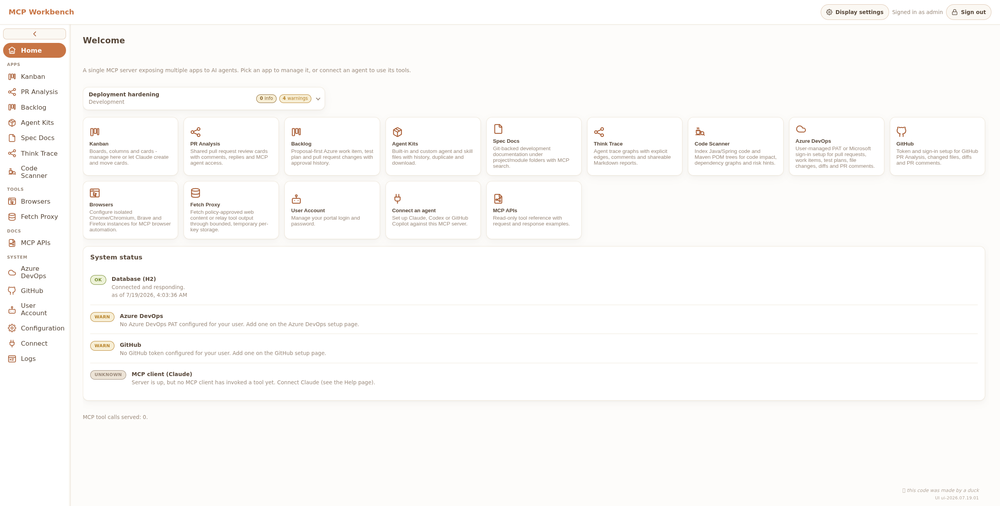

The portal uses an embedded H2 database by default and can use PostgreSQL for shared/server
deployments. External systems are contacted only through the integrations you configure, and every
MCP key can be limited to the tools its agent actually needs.

## Why use it?

- **One MCP endpoint, many workflows.** Connect an agent once, then use Kanban, PR analysis,
  backlog proposals, code scanning, browser automation, Fetch Proxy, Think Trace, and more.
- **Approval-first changes.** Prepare repository and work-item mutations locally, review them in the
  portal, and push only the proposals you approve.
- **Local-first persistence.** Boards, analyses, traces, policies, credentials, and audit records
  remain in the configured application data directory.
- **Scoped agent access.** Issue a separate MCP key per agent and restrict each key to an explicit
  set of apps.
- **Safe browser sessions.** Browsers start with fresh isolated profiles rather than your personal
  browser profile, passwords, cookies, or extensions.
- **Useful results at any size.** Fetch Proxy can retrieve an HTTP resource or delegate an MCP tool
  call, retain the result temporarily, and return it in bounded parts.
- **A portal for humans.** Inspect what agents created, understand code relationships, annotate live
  browser sessions, and administer the service without editing configuration files.

## How it fits together

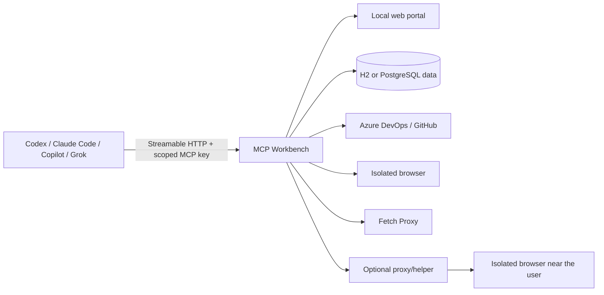

Browser commands use the same API in both supported execution paths:

```text
AI → MCP Workbench → Browser
AI → MCP Workbench → proxy/helper → Browser
```

The second path is useful when Workbench runs on another machine. The helper initiates an
authenticated connection to Workbench and translates the existing browser API into local browser
commands; it does not expose the user's normal browser profile.

## Product tour

### Plan work and review changes

Kanban provides persistent boards, ordered columns, card assignment, due dates, search, and direct
links agents can return to a user.

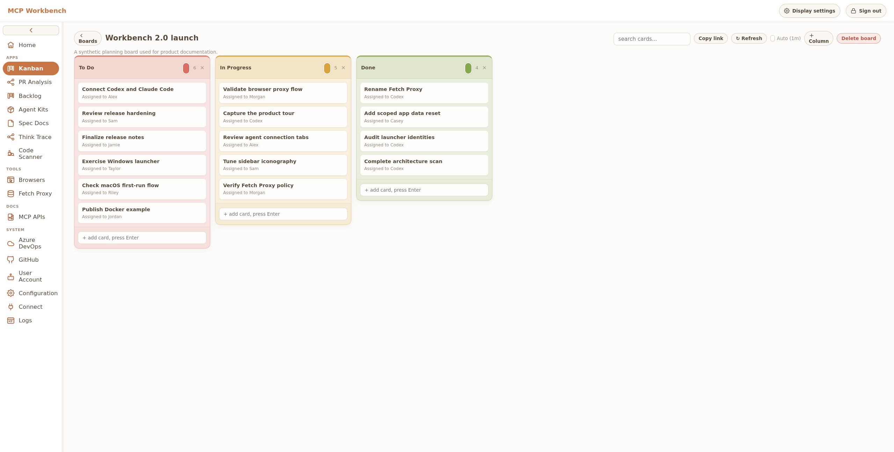

PR Analysis turns an Azure DevOps or GitHub pull request into a review workspace. Findings are
organized by severity, category, file, and line, with a controlled path for publishing selected
comments.

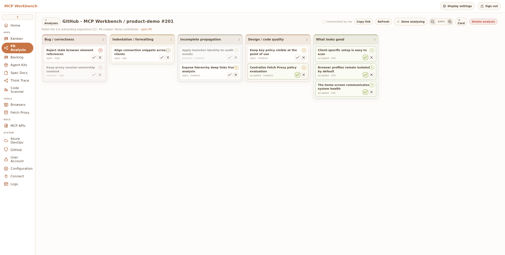

### Make agent reasoning inspectable

Think Trace records a run as typed nodes and edges instead of hiding it in a chat transcript.
Reports, comments, tools, evidence, decisions, and changes can be inspected together.

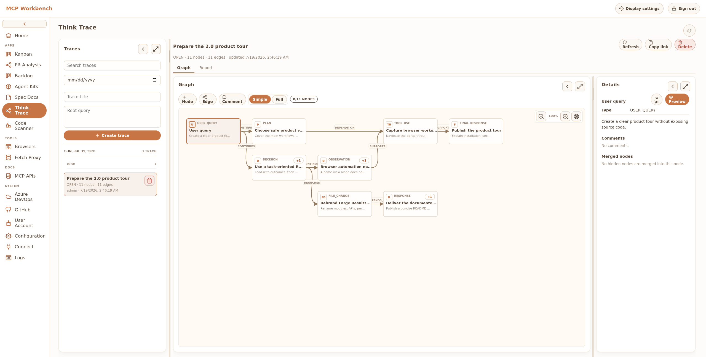

The expanded graph makes the full execution path easier to present or audit.

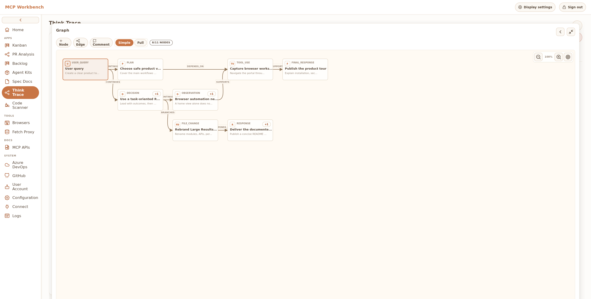

### Explore a codebase without pasting it into chat

Code Scanner indexes local folders or authenticated Azure DevOps and GitHub branches. Java-aware
scans add deterministic symbol, configuration, entry-point, reference, Data I/O, Maven dependency,
and CVE analysis.

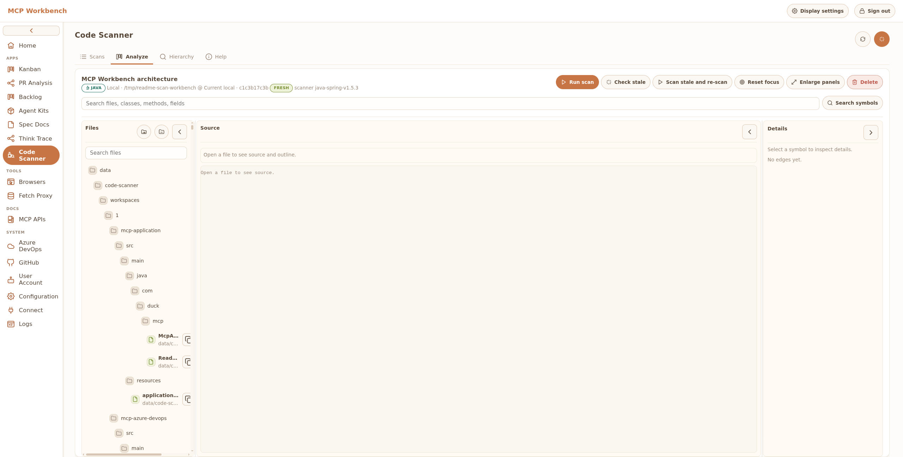

Hierarchy search turns a focused symbol into a navigable reference graph. The screenshot shows
names and relationships only—not source bodies.

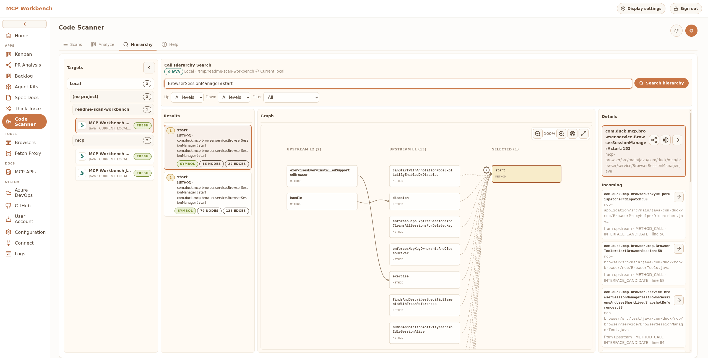

Entry-point browsing brings HTTP endpoints, MCP tools, listeners, and service APIs into one filterable
view.

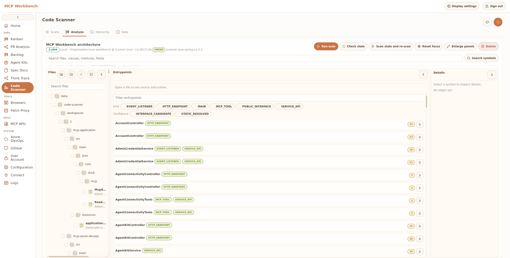

### Connect agents and controlled execution

The Connect page provides a four-step tutorial with client-specific tabs for Claude Code, Codex,
GitHub Copilot, and Grok, plus a searchable inventory of the tools enabled for the current key.

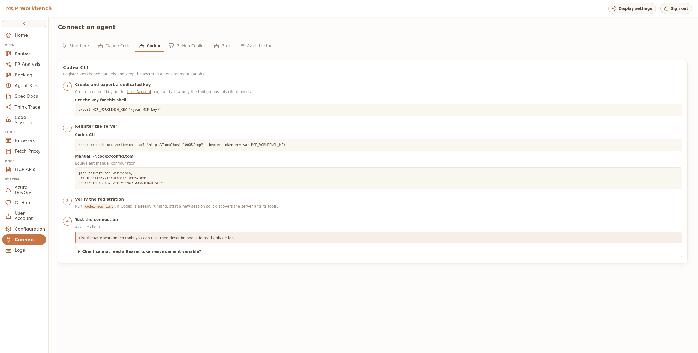

Browser Automation discovers installed Chromium, Chrome, Brave, and Firefox executables and creates
reusable hardened configurations for direct or proxied sessions.

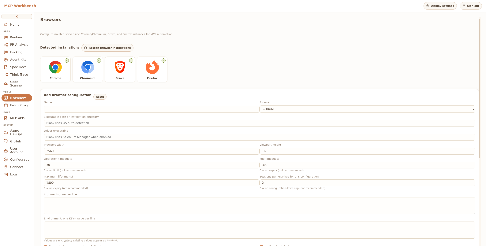

Fetch Proxy applies global and per-key policy to outbound HTTP fetches and delegated tool results.

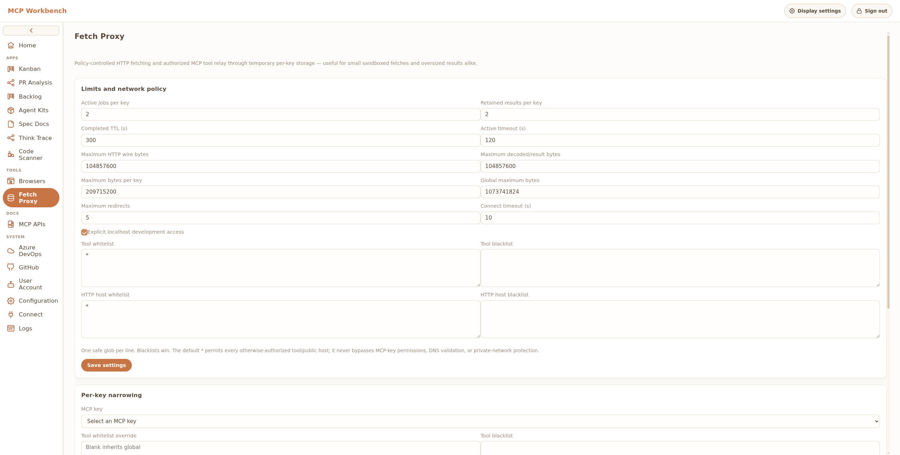

## Apps

### Workspace

| App | What it provides |
| --- | --- |
| **Kanban** | Persistent boards, columns, cards, labels, assignment, due dates, search, movement, and portal links. |
| **PR Analysis** | Local Azure DevOps and GitHub review cards, structured findings, file diffs, and selected-comment publishing. |
| **Backlog** | Approval-first proposals for work-item and issue changes, test plans, and pull requests before remote mutation. |
| **Agent Kits** | Reusable agent instructions and task-oriented kits that can be discovered through MCP. |
| **Spec Docs** | Structured specifications and project documentation for human and agent collaboration. |
| **Think Trace** | Typed execution graphs, evidence, decisions, comments, reports, comparisons, and shareable portal views. |
| **Code Scanner** | Local or remote code indexes; Java symbols, hierarchy, entry points, configuration, Data I/O, Maven dependencies, and OSV CVEs. |

### Integrations and administration

| App | What it provides |
| --- | --- |
| **Azure DevOps** | Authenticated projects, repositories, pull requests, work items, trees, file content, and diffs. |
| **GitHub** | Authenticated repositories, branches, pull requests, comments, issues, and approval-first write proposals. |
| **Browsers** | Isolated Chromium, Chrome, Brave, or Firefox sessions with semantic snapshots, interaction, screenshots, and cooperative annotations. |
| **Fetch Proxy** | Policy-controlled HTTP retrieval and delegated MCP calls with bounded, temporary result storage. |
| **User Account** | Password management and the signed-in user's security controls. |
| **Configuration** | Tabbed system, security, integration, database migration, and persistence settings. |
| **MCP APIs** | Scoped MCP keys, allowed-tool selection, deny-by-default immediate remote-write permission, status, last use, regeneration, and revocation. |
| **Connect** | Client-specific setup tutorial and available-tool discovery. |
| **Logs** | Searchable operational and audit logs, including launcher identities. |

## Install

### Recommended: desktop bundle

Download the latest bundle from
[MCP Workbench Releases](https://github.com/shreduck/mcp-workbench-release/releases/latest).
Release assets include SHA-256 checksum files.

#### Windows

1. Download `mcp-workbench-windows-with-jre-<version>.zip`.
2. Extract it to a writable folder.
3. Run `MCP Workbench.exe`.
4. Confirm the data directory and port. The defaults are `data\` beside the executable and `9999`.
5. Select **Open Browser** when the server is ready.

The launcher can start Workbench when you sign in and otherwise stays available from the system
tray. If Java 22 or newer is already on `PATH`, the smaller
`mcp-workbench-windows-launcher-<version>.zip` can be used instead; start it with
`run-mcp-workbench.bat`.

#### macOS

1. Download `mcp-workbench-mac-with-jre-<version>.zip`.
2. Extract it and move `MCP Workbench.app` where you want to keep it.
3. Open the app and confirm the data directory and port. The defaults are
   `~/Library/Application Support/MCP Workbench/data` and `9999`.
4. Select **Open Browser** when the server is ready.

The launcher can create a current-user login item and can remain available in the menu bar. If Java
22 or newer is already on `PATH`, use `mcp-workbench-mac-launcher-<version>.zip` and start
`run-mcp-workbench.command`.

MCP Workbench is currently distributed outside the Mac App Store. If macOS blocks the first launch:

1. Try to open `MCP Workbench.app` once, then dismiss the warning.
2. Open **Apple menu → System Settings → Privacy & Security**.
3. Authenticate and confirm **Open**.

Only override Gatekeeper after verifying that the archive and checksum came from the release
repository. Apple documents this flow in
[Open a Mac app from an unknown developer](https://support.apple.com/en-euro/guide/mac-help/mh40617/mac).

### Docker

The published image is `ghcr.io/shreduck/mcp-workbench`. Persist `/app/data`; the container runs as
UID/GID `1000`.

```bash
mkdir -p mcp-data
sudo chown 1000:1000 mcp-data
docker run --rm \
  -p 9999:9999 \
  -v "$PWD/mcp-data:/app/data" \
  ghcr.io/shreduck/mcp-workbench:latest
```

To build and run the checked-in Compose configuration:

```bash
cd docker
cp .env.example .env
docker compose up -d --build
```

### Executable jar or source

The release repository also provides `mcp-workbench-<version>.jar`, which requires Java 22 or newer:

```bash
APP_DATA_DIR="$PWD/mcp-data" java -jar mcp-workbench-<version>.jar
```

To build the current source:

```bash
mvn package
java -jar mcp-application/target/mcp-server.jar
```

For a development run:

```bash
mvn -pl :mcp-application -am spring-boot:run
```

Open `http://localhost:9999`. The initial local administrator is `admin` with password `changeit`;
change it immediately before exposing the service beyond a trusted development machine.

## Connect an AI client

1. Sign in to the portal and open **MCP APIs**.
2. Create a key with a descriptive label such as `codex-local`.
3. Limit the key to the apps that client should use and copy the secret when it is shown.
4. Open **Connect** and select the client tab for the exact configuration format.
5. Verify the connection with a read-only request, for example: “List the available MCP Workbench
   tools and do not change anything.”

The MCP endpoint is:

```text
http://localhost:9999/mcp
```

Use `Authorization: Bearer <key>` when the client supports custom headers. A URL-key fallback is
available for clients that cannot send headers, but headers avoid placing secrets in URLs, history,
or access logs.

## Security model

MCP Workbench is designed for trusted local or team-controlled deployment, with explicit controls at
each boundary:

- passwords and integration tokens are encrypted at rest using the configured application key;
- MCP keys are stored as hashes, shown once, independently scoped, auditable, and revocable;
- state-changing backlog and review workflows are approval-first; proposal-tool
  `pushOntoDevops=true` and `pushOntoGitHub=true` requests are rejected unless the MCP key owner
  explicitly enables its **Immediate remote writes** permission;
- audit entries record portal, MCP, macOS launcher, and Windows launcher identities;
- the home-page hardening card summarizes warnings and expands to the remediation details;
- application data can be reset by persistence unit or all at once by an administrator;
- external integrations are disabled until configured.

Do not expose port `9999` directly to an untrusted network. Put remote deployments behind TLS,
network access control, and an authenticating reverse proxy.

### Browser isolation

Browser Automation starts a fresh temporary profile for every session. It does not attach to the
user's everyday profile and therefore does not inherit saved passwords, history, cookies, extensions,
or active logins. A direct session is local to Workbench; a proxied session uses the same commands
through an authenticated helper near the browser.

The proxy connection is outbound, authenticated WSS. Workbench sends sanitized browser
configuration metadata and never needs to disclose local executable paths, environment overrides,
profile paths, or helper session identifiers. See the complete
[browser execution protocol](mcp-browser/docs/browser-execution-protocol.md).

### Fetch Proxy policy

Fetch Proxy is useful for both small sandbox-constrained fetches and results too large for one MCP
response. Its controls include:

- host and delegated-tool allow/deny rules, with deny taking precedence;
- per-key policy that can narrow but never widen the global policy;
- the ordinary MCP app entitlement check before a fetch starts;
- DNS and resolved-address protections for private or otherwise forbidden targets;
- safe request headers and HTTP `GET`/`HEAD` only;
- concurrency, byte, part-size, timeout, retention, and TTL limits.

Its clean 2.0.1 MCP surface is:

```text
startWebFetch
startToolFetch
getFetchResultStatus
listFetchResults
getFetchResultPart
searchFetchTextResult
deleteFetchResult
```

Earlier pre-release tool names are intentionally not retained as compatibility aliases.

## Configuration

Common environment variables:

| Variable | Purpose |
| --- | --- |
| `SERVER_PORT` | HTTP and MCP port; default `9999`. |
| `APP_DATA_DIR` | Persistent database, runtime, and application data root. |
| `APP_DATABASE_URL` | Primary JDBC URL. Defaults to the H2 file under `APP_DATA_DIR`; PostgreSQL URLs use `jdbc:postgresql://…`. |
| `APP_DATABASE_USERNAME` | Primary database username; default `sa` for H2. |
| `APP_DATABASE_PASSWORD` | Primary database password. |
| `APP_DATABASE_IMPORT_MAX_FILE_SIZE` | Maximum H2 `.mv.db` upload accepted by database migration; default `2GB`. |
| `APP_ENCRYPTION_KEY` | Stable secret used to protect stored credentials. Set this explicitly for persistent deployments. |
| `APP_TRUST_PROXY` | Trust forwarded headers only when Workbench is behind a correctly configured trusted proxy. |
| `APP_BROWSER_PROXY_ENABLED` | Permit configured cooperative browser helpers. |
| `APP_FETCH_PROXY_*` | Fetch Proxy limits and policy defaults; the portal exposes the supported settings. |

Spring Boot configuration can also be supplied through environment variables, JVM properties, or an
external configuration file. Keep the same `APP_ENCRYPTION_KEY` when moving an existing data
directory or its encrypted credentials will no longer be readable.

The Windows and macOS launchers expose these database values under the collapsible
**Advanced database options** section of the startup dialog. They persist `databaseUrl`,
`databaseUsername`, `databasePassword`, and `databaseImportMaxFileSize` in
`mcp-workbench-launcher.properties` and forward configured values to the server. Leave the JDBC URL
blank to keep using embedded H2. The launcher properties file stores the database password as plain
text, so protect it with normal user-only filesystem permissions.

For PostgreSQL, create an empty database and start Workbench with:

```bash
APP_DATABASE_URL="jdbc:postgresql://postgres.example:5432/mcp_workbench" \
APP_DATABASE_USERNAME="mcp_workbench" \
APP_DATABASE_PASSWORD="replace-me" \
java -jar mcp-server.jar
```

Liquibase creates or upgrades the schema at startup. To copy application data from another
Workbench database, open **Configuration → Database**, select an H2 `.mv.db` file or enter a
PostgreSQL JDBC URL, and scan it. Workbench compares Liquibase history, displays row counts by
application, Users, and System persistence group, exposes the exact source-only and
destination-only changesets, and asks which groups to replace. Matching schemas import directly;
older schemas require explicit acknowledgement, newer schemas show a non-blocking upgrade
suggestion and copy fields supported by the current version, while divergent or unrecognized
schemas are blocked. Sensitive Users and System cards require explicit selection. See
[database deployment and migration](docs/database.md) for the full behavior.

## Development

Prerequisites are JDK 22+ and Maven 3.8+.

```bash
mvn test
```

The reactor is split by capability:

```text
mcp-common              shared security, audit, and infrastructure
mcp-azure-devops        Azure DevOps read APIs
mcp-github              GitHub read and issue APIs
mcp-azure-tools         Azure DevOps project/tool support
mcp-kanban              local boards
mcp-pr-analysis         pull-request analysis
mcp-backlog             approval-first change proposals
mcp-think-trace         execution graphs
mcp-code-scanner        language and Maven analysis modules
mcp-fetch-proxy         bounded HTTP and delegated-tool results
mcp-browser             direct and proxied browser automation
mcp-management          portal, users, configuration, and audit UI
mcp-application         Spring Boot assembly
mcp-windows / mcp-mac   desktop launchers
```

Operational and publishing details live under [`docs/`](docs/). Browser implementers should start
with the protocol document linked above.

## License

MCP Workbench is source-available under the
[Research & Learning Commons License](LICENSE). Non-commercial personal, educational, and research
use is permitted by the license. Commercial or enterprise use requires written permission after the
single shared 30-day non-production evaluation. Contact `duck_code_contact@proton.me` for commercial
licensing.
